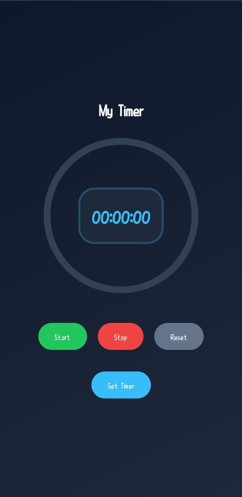

# Timer App

A simple and user-friendly Android Timer App built with **Kotlin** and **Jetpack Compose**.

The app was developed from a basic timer into a more feature-rich timer and stopwatch application.

## Final App

## Features

- Start, Stop, and Reset timer
- Timer state preserved during screen rotation
- Pulsing glow animation
- Circular progress ring
- Minute milestone message with beep
- Stopwatch and Set Timer navigation
- Countdown timer with hours, minutes, and seconds picker
- Countdown completion alert
- Quick 1, 5, and 10-minute presets

## Development Screenshots

The `screenshots` folder contains screenshots showing the different stages and features added during development.

## Project Structure

- `MainActivity.kt` — Compose UI and app screens
- `TimerViewModel.kt` — Timer logic and state management
- `screenshots/` — Development screenshots

## Technologies

- **Kotlin**
- **Jetpack Compose**
- **Android Studio**
- **ViewModel**

## Project

Developed as part of my **Mobile Application Development** coursework.